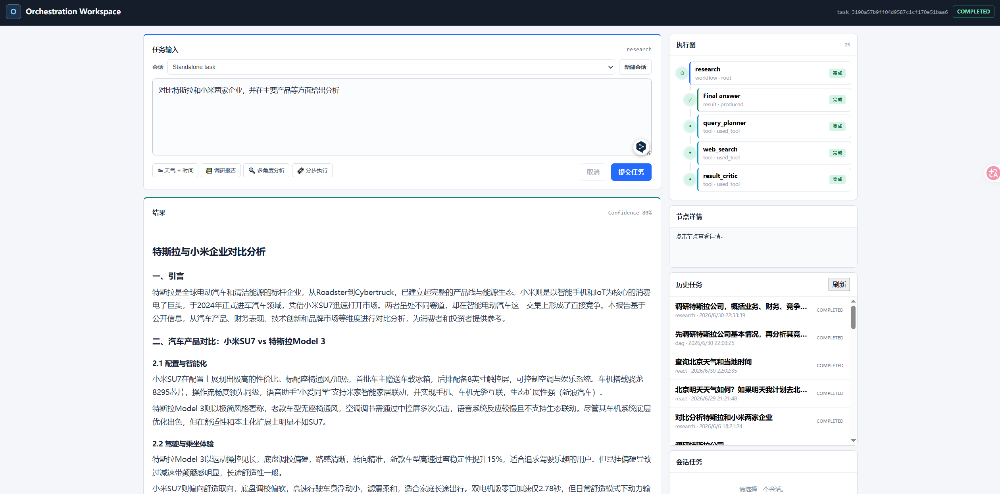
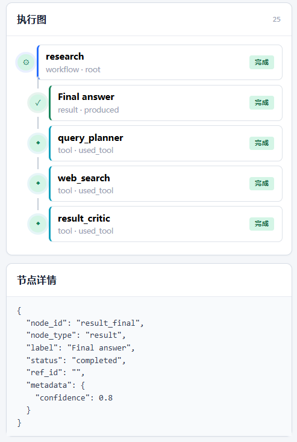

# 多智能体动态编排框架

一个基于 FastAPI 的轻量级多智能体任务编排框架。你只需用自然语言描述任务，框架会自动选择最合适的执行策略——是直接回答、调用工具、搜索网页，还是派出多个子智能体协同工作——最终返回带引用来源的结构化结果（也可以根据要求生成结果文件）。

<p align="center">
  <em>输入自然语言 → 自动路由 → 工具 / 子智能体协作 → 结构化结果 + 执行回放</em>
</p>

## 界面预览

<p align="center">
  
</p>

<p align="center">
  <em>主界面：左侧为任务输入与结果面板，右侧为执行图、节点详情、历史任务和事件时间线</em>
</p>

  
<br>
<br>

<p align="center">
  
</p>

<p align="center">
  <em>执行图与节点详情：按层级展示工作流 → 智能体 → 工具调用 → 最终结果的完整链路，点击节点可查看原始事件数据，实时显示任务进度和主要过程</em>
</p>

## 项目简介

项目为多智能体协作的实验项目，针对于日常使用大模型场景下的任务处理问题。  
项目出发点——*不同类型的任务应该需要不同的处理方式。*  
**简单问题、调研任务、多步骤分析对执行策略的要求完全不同，但手动为每种场景选择合适的工具和工作流既繁琐又容易出错**。这个项目将"判断该怎么做"这件事交给了框架本身——你只需要描述你想做什么，Orchestrator 会自动分析任务特征，决定是直接生成回答、调用外部工具、联网搜索取证，还是派出多个子智能体分工协作，并在执行失败时自动降级兜底，最终交付带引用来源和完整执行记录的结构化结果。

框架做的事情：

1. **理解任务**——分析用户输入，判断复杂度、是否需要联网、是否涉及多步骤依赖。
2. **选择工作流**——从 7 种工作流中自动选出最合适的一种（也支持用户显式指定）。
3. **调度执行**——必要时调用工具（搜索、天气、计算器等），必要时派出子智能体并行/串行工作。
4. **降级兜底**——LLM 输出解析失败、网页抓取超时、模型调用出错时，自动降级而非直接崩溃。
5. **可观测输出**——所有决策和执行过程以事件流 + 执行图的形式完整记录，支持实时 SSE 推送和事后回放。

适合用于：

- 构建带引用来源的研究型问答流程。
- 对比不同多智能体工作流的执行效果。
- 演示任务路由、工具调用、执行图和事件回放。
- 生成任务级 Markdown、文本、JSON、CSV 或 ZIP 产物。
- 作为多智能体编排、RAG/Research Agent、工具代理等方向的实验底座。

## 前置要求

- **Python ≥ 3.10**（项目使用了 `list[X]` / `tuple[X, ...]` 等新式类型语法）
- 推荐使用 Conda 或 venv 虚拟环境
- 如需真实 LLM 调用，需要 DeepSeek API Key（或任意 OpenAI 兼容服务）
- 如需网页搜索功能，需要 [Tavily](https://tavily.com) API Key
- 如需天气查询功能，需要 [WeatherAPI](https://www.weatherapi.com) API Key

> 💡 以上 API Key 均为可选项。不配置时，框架使用内置 Mock 响应运行，适合开发调试和跑测试。

## 快速启动

### 1. 克隆并进入项目

```bash
git clone <your-repo-url>
cd project_new
```

### 2. 创建虚拟环境（二选一）

**方式 A：Conda（推荐）**

```bash
conda create -n orchestration python=3.10 -y
conda activate orchestration
pip install fastapi httpx pydantic uvicorn
```

**方式 B：venv**

```bash
python3.10 -m venv .venv
# Linux / macOS
source .venv/bin/activate
# Windows PowerShell
.\.venv\Scripts\Activate.ps1

pip install fastapi httpx pydantic uvicorn
```

### 3. 配置环境变量

在项目根目录创建 `.env` 文件（该文件已被 `.gitignore` 排除，不会提交到 Git）：

```bash
# 必填：LLM 服务配置（以 DeepSeek 为例）
LLM_BASE_URL=https://api.deepseek.com
LLM_API_KEY=你的-deepseek-api-key
LLM_MODEL=deepseek-chat

# 可选：网页搜索（用于 research 工作流）
TAVILY_API_KEY=你的-tavily-api-key

# 可选：天气查询
WEATHER_API_KEY=你的-weather-api-key
```

也可以直接设置系统环境变量：

| 平台 | 示例 |
|------|------|
| **Linux / macOS** | `export LLM_API_KEY=你的-key` |
| **Windows PowerShell** | `$env:LLM_API_KEY='你的-key'` |
| **Windows CMD** | `set LLM_API_KEY=你的-key` |

完整环境变量列表见下方 [环境变量参考](#环境变量参考)。

### 4. 启动服务

```bash
uvicorn app.main:app --host 127.0.0.1 --port 8000
```

然后在浏览器打开 **http://127.0.0.1:8000/ui**。

如果一切正常，你会看到任务提交界面，可以粘贴下方的示例任务直接体验。

### 5. 运行测试（可选）

```bash
python -m pytest
ruff check app tests
```

> 自动化测试使用内置 Mock 响应，不需要外部 API Key。

## 工作流说明

框架支持 7 种工作流，由混合路由引擎（规则 + LLM 双重决策）自动选择。你也可以理解每种工作流的适用场景，写出更精准的任务描述。

| 工作流 | 适用场景 | 典型任务示例 |
|--------|----------|-------------|
| **direct** | 简单问答、解释说明，无需外部工具 | "什么是多智能体编排？" |
| **react** | 需要调用天气、时间、计算器等确定性工具的单一任务 | "查询北京天气和当前时间" |
| **research** | 需要搜索网页、获取引用来源的研究型任务 | "调研特斯拉公司业务和竞争格局，给出引用" |
| **plan_execute** | 中等复杂度，需要分步规划但子任务间无严格依赖 | "制定一个多智能体框架的技术选型方案" |
| **supervisor** | 需要多角度分析、综合研判的复杂任务 | "分析多智能体框架的发展趋势、代表项目、风险和适用场景" |
| **dag** | 子任务间存在明确先后依赖关系 | "先调研特斯拉基本情况→再分析其竞争格局→最后生成风险报告" |
| **swarm** | 实验性蜂群式协作（需用户在任务中明确提及"swarm"或"蜂群"） | "使用蜂群模式分析 AI 芯片市场" |

### 路由决策流程

```text
用户输入
    │
    ▼
┌──────────────┐     ┌──────────────┐     ┌──────────────────┐
│  规则匹配     │     │  LLM 分类    │     │  调和 & 安全约束  │
│ (route_by_   │ + │  (GPT 兼容   │ ──▶ │  (reconcile +    │
│  rules)      │     │   接口)      │     │   guardrails)    │
└──────────────┘     └──────────────┘     └──────────────────┘
                                                    │
                                                    ▼
                                          ┌──────────────────┐
                                          │  选定的工作流      │
                                          │  + 执行约束       │
                                          └──────────────────┘
```

## 示例任务

以下是可直接粘贴到 Web UI 中运行的示例。每个示例会自动匹配到对应的工作流。

**ReAct 工具调用（天气 + 时间）：**
```text
查询北京天气和当前本地时间
```

**Research 调研 + 引用来源：**
```text
调研特斯拉公司，概括业务、财务、竞争格局和近期动态，并给出引用来源
```

**DAG 依赖执行（先→再→最后）：**
```text
先调研特斯拉公司基本情况，再分析其竞争格局，最后生成风险报告
```

**产物导出（生成文件）：**
```text
生成一份多智能体框架调研报告，并保存为 Markdown 文件
```

**Supervisor 多角度分析：**
```text
分析多智能体框架的发展趋势、代表项目、风险和适用场景
```

## 功能特性

| 模块 | 说明 |
|------|------|
| 智能路由 | 规则匹配 + LLM 分类混合决策，自动选择最优工作流 |
| 后端服务 | 基于 FastAPI 异步框架，使用 SQLite 持久化任务、事件和结果 |
| 模型接入 | OpenAI 兼容接口，支持 DeepSeek、通义千问等兼容服务 |
| 多工作流 | 7 种工作流覆盖从简单问答到 DAG 依赖执行的各类场景 |
| 工具系统 | 内置网页搜索、内容抓取、天气、时间、计算器、日期换算、单位换算等工具 |
| 结果产物 | 支持生成 Markdown、文本、JSON、CSV 和 ZIP 打包文件 |
| 可观测性 | 事件历史、SSE 实时流、任务回放、执行图可视化 |
| 降级策略 | JSON 修复重试、LLM 调用降级、证据兜底、多层级容错 |
| 安全防护 | 产物文件名校验、路径穿越防护、工具白名单、调用次数限制、CSV 注入防护 |

## 项目结构

```text
project_new/
├── app/
│   ├── main.py               FastAPI 应用入口，所有路由注册
│   ├── api/                   API 路由层
│   ├── core/                  配置管理、枚举类型、自定义异常
│   ├── db/                    SQLite 数据库初始化与 Repository 仓储
│   ├── llm/                   LLM 客户端（OpenAI 兼容 + Mock）、任务感知代理
│   ├── orchestration/         编排核心：路由器、提示词、JSON 修复器、编排器
│   ├── agents/                子智能体上下文构建与运行时
│   ├── tools/                 工具注册中心、安全策略、执行器
│   │   └── builtin/           内置工具集（搜索、天气、计算器等）
│   ├── services/              业务服务：任务、事件、结果、产物
│   ├── schemas/               Pydantic 数据模型定义
│   ├── workflows/             工作流抽象基类
│   └── static/                浏览器前端（HTML + vanilla JS + CSS）
├── tests/                     自动化测试（pytest + Mock）
├── scripts/                   真实 LLM 服务验证脚本
├── docs/                      设计文档与实施记录
├── pyproject.toml             项目元数据与依赖声明
└── README.md                  本文件
```

## 环境变量参考

### LLM 服务配置

| 变量 | 必填 | 默认值 | 说明 |
|------|------|--------|------|
| `LLM_BASE_URL` | 是 | `https://api.deepseek.com` | OpenAI 兼容 API 地址 |
| `LLM_API_KEY` | 是 | — | API 密钥 |
| `LLM_MODEL` | 是 | `deepseek-chat` | 模型名称 |
| `LLM_TEMPERATURE` | 否 | `0.2` | 生成温度 |
| `LLM_MAX_TOKENS` | 否 | `8192` | 最大输出 token 数 |
| `REQUEST_TIMEOUT_SECONDS` | 否 | `120` | HTTP 请求超时（秒） |
| `TASK_TIMEOUT_SECONDS` | 否 | `600` | 单任务最大执行时长（秒） |
| `LLM_RETRIES` | 否 | `2` | LLM 调用失败重试次数 |

### 工具配置

| 变量 | 必填 | 默认值 | 说明 |
|------|------|--------|------|
| `TAVILY_API_KEY` | 否 | — | Tavily 网页搜索 API Key |
| `TAVILY_RETRIES` | 否 | `1` | 搜索重试次数 |
| `WEATHER_API_KEY` | 否 | — | WeatherAPI 天气 API Key |
| `WEATHER_BASE_URL` | 否 | `https://api.weatherapi.com/v1` | 天气 API 地址 |
| `WEATHER_PROVIDER` | 否 | `weatherapi` | 天气服务提供商 |

### 执行约束

| 变量 | 默认值 | 硬上限 | 说明 |
|------|--------|--------|------|
| `MAX_SWARM_ROUNDS` | `2` | `3` | 蜂群工作流最大轮次 |
| `MAX_AGENTS` | `4` | `6` | 单轮最大子智能体数 |
| `MAX_CONCURRENT_AGENTS` | `2` | `3` | 最大并发子智能体数 |
| `MAX_TOOL_CALLS` | `12` | — | 单任务最大工具调用次数 |
| `REACT_MAX_TOOL_CALLS` | `5` | — | ReAct 模式最大工具调用次数 |

### 研究 & 搜索约束

| 变量 | 默认值 | 说明 |
|------|--------|------|
| `SEARCH_RESULTS_LIMIT` | `5` | 每次搜索返回结果上限 |
| `RESEARCH_MAX_QUERIES` | `5` | 单次调研任务的最大搜索查询数 |
| `RESEARCH_AUTO_FETCH_PAGES` | `3` | 自动抓取网页数量 |
| `MAX_FETCH_CHARS` | `12000` | 单页抓取最大字符数 |
| `FETCH_TOP_RESULTS` | `2` | 搜索后自动抓取的前 N 条结果 |
| `EVIDENCE_PER_SUBTASK` | `3` | 每个子任务保留的证据条数 |
| `FETCH_RETRIES` | `1` | 网页抓取重试次数 |

### 产物配置

| 变量 | 默认值 | 说明 |
|------|--------|------|
| `ARTIFACT_ROOT` | `artifacts` | 产物存储根目录 |
| `ARTIFACT_MAX_FILES_PER_TASK` | `10` | 单任务最大产物文件数 |
| `ARTIFACT_MAX_FILE_BYTES` | `1048576` (1 MB) | 单文件最大字节数 |
| `ARTIFACT_MAX_ARCHIVE_INPUT_BYTES` | `5242880` (5 MB) | 打包压缩最大输入字节数 |


## 常见问题

### 测试全部失败，报 `TypeError: 'type' object is not subscriptable`

你使用的 Python 版本低于 3.10，不支持新式泛型语法。请切换到 Python ≥ 3.10 环境：

```bash
python --version  # 确认版本
conda activate orchestration  # 或你的 Python 3.10+ 环境
```


### 如何用其他 LLM 提供商？

只要服务商提供 OpenAI 兼容接口即可。例如：

- **通义千问（阿里云）**：设置 `LLM_BASE_URL=https://dashscope.aliyuncs.com/compatible-mode/v1`，`LLM_MODEL=qwen-plus`
- **Moonshot（月之暗面）**：设置 `LLM_BASE_URL=https://api.moonshot.cn/v1`，`LLM_MODEL=moonshot-v1-8k`
- **Ollama 本地模型**：设置 `LLM_BASE_URL=http://localhost:11434/v1`，`LLM_MODEL=你的本地模型名`

### 前端界面打不开？

确认 `app/static/` 目录下存在 `index.html`、`app.js`、`styles.css` 三个文件。如果缺失，框架会返回 404。

### 产物文件下载报 404？

产物文件存储在 `ARTIFACT_ROOT` 指定的目录下（默认 `artifacts/`）。请确认该目录存在且有读写权限。


